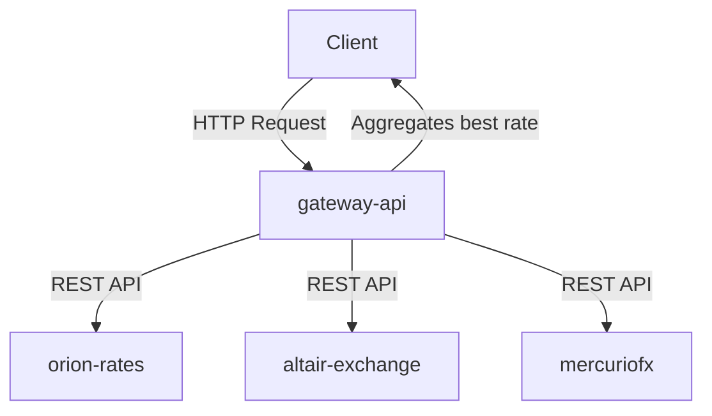

# exchange-rate

> **Note:** Docker must be running before executing the project.
> **Info:** All API keys are set up in the docker-compose file only for demo purposes.

## 1. Overview

Multi-service platform for currency exchange, including:

- NestJS APIs (`orion-rates`, `altair-exchange`)
- .NET APIs (`gateway-api`)
- Java/Quarkus microservice (`mercuriofx`)

## 2. Project Structure

```
orion-rates/
altair-exchange/
Gateway/
mercuriofx/
docker-compose.yml
```

## 3. Currency Conversion Available

The following currency pairs are supported for conversion:

| From | To  |
| ---- | --- |
| USD  | EUR |
| EUR  | USD |
| USD  | GBP |
| GBP  | USD |
| EUR  | GBP |
| GBP  | EUR |
| USD  | JPY |
| JPY  | USD |
| EUR  | JPY |
| JPY  | EUR |
| USD  | DOP |
| DOP  | USD |
| EUR  | DOP |
| DOP  | EUR |
| GBP  | DOP |
| DOP  | GBP |
| JPY  | DOP |
| DOP  | JPY |

## 4. Communication Diagram

The `gateway-api` communicates with all backend services (`orion-rates`, `altair-exchange`, `mercuriofx`) to get the best exchange rate offer for the client request.



## 5. Services

- **orion-rates**: NestJS API for currency rates and conversion.
- **altair-exchange**: NestJS API for currency rates and conversion.
- **gateway-api**: .NET API gateway for service orchestration.
- **mercuriofx**: Java/Quarkus microservice for currency conversion.

## 6. Running Locally (Step by Step)

### Step 1: Build and start all services

```sh
docker compose up --build
```

### Step 2: Access services and Swagger documentation

- orion-rates: [http://localhost:3000](http://localhost:3000) | Swagger: [http://localhost:3000/api](http://localhost:3000/api)
- altair-exchange: [http://localhost:5600](http://localhost:5600) | Swagger: [http://localhost:5600/api](http://localhost:5600/api)
- gateway-api: [http://localhost:5500](http://localhost:5500) | Swagger: [http://localhost:5500/swagger](http://localhost:5500/swagger)
- mercuriofx: [http://localhost:4000](http://localhost:4000) | Swagger: [http://localhost:4000/q/swagger-ui](http://localhost:4000/q/swagger-ui)
